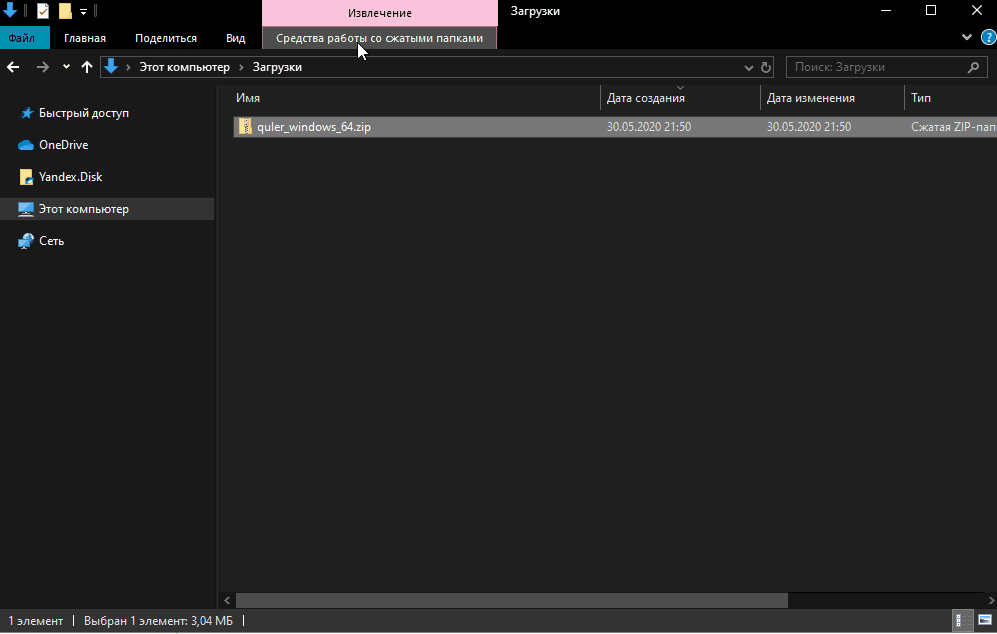

# QULER
Read message from RabbitMQ cross platform  
1. Download app from [release folder](https://github.com/vmpartner/quler/releases)  
2. Change config app.conf
3. Run ``` ./quler_windows_64.exe ``` 


